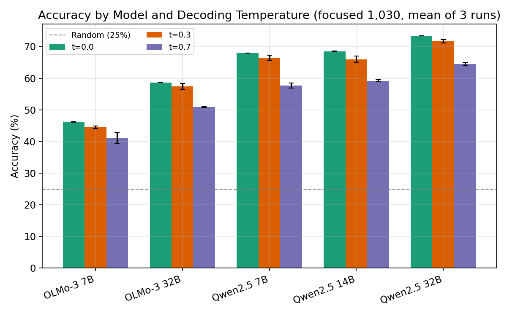
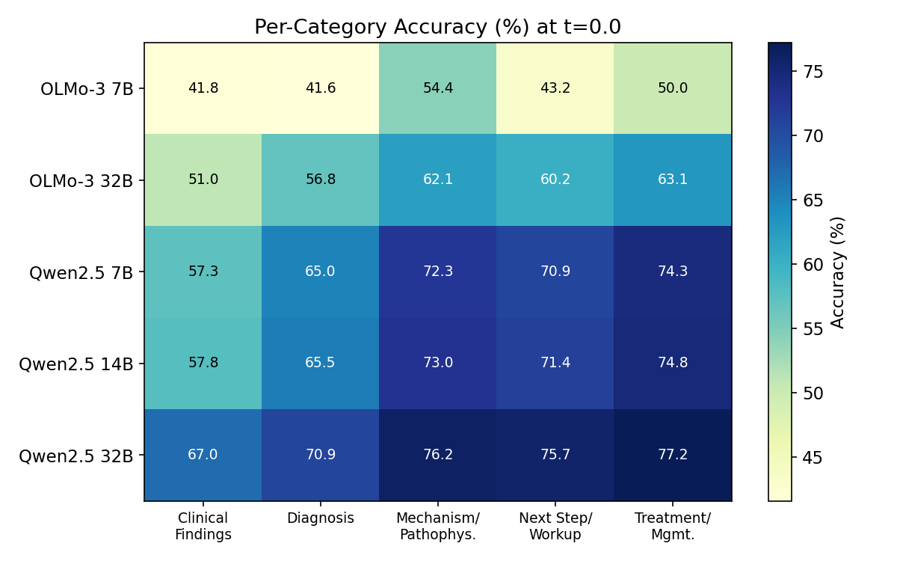
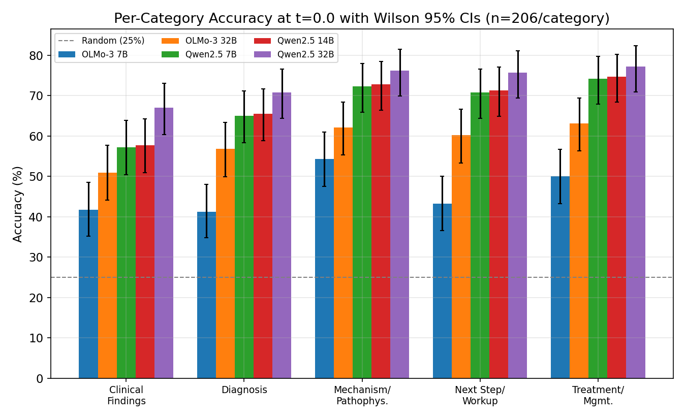
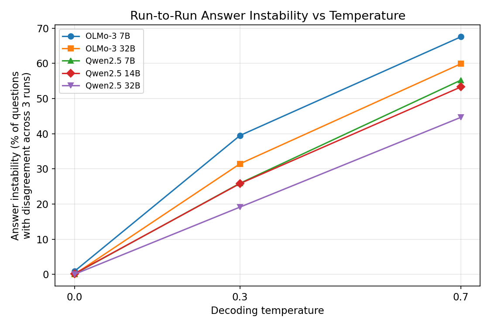
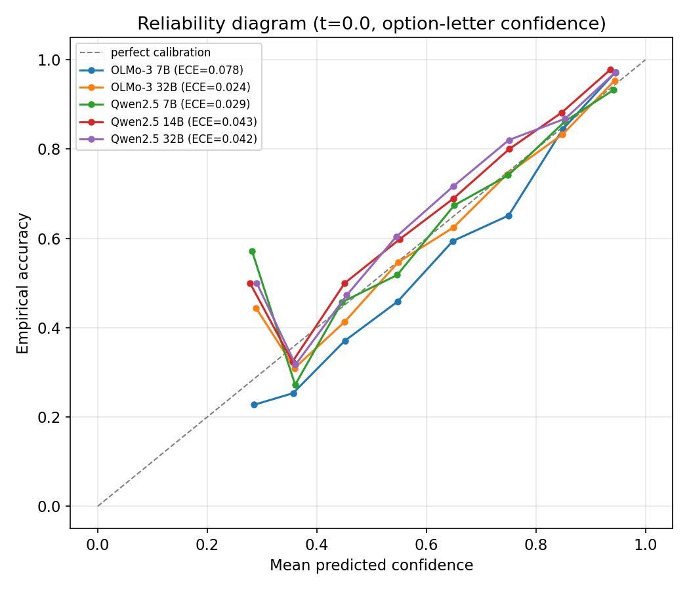
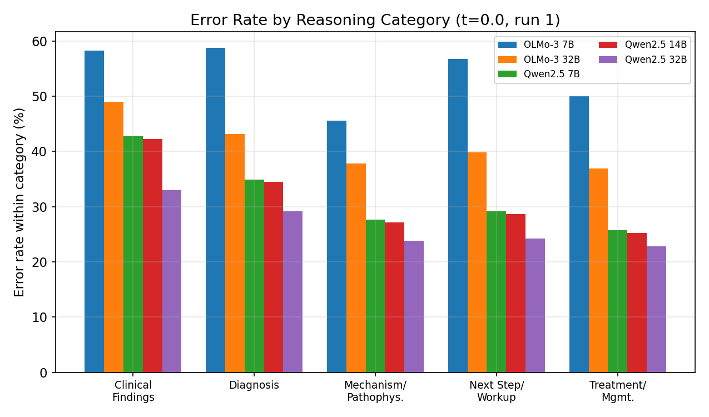

## Title (working; alternates below)
**Beyond Aggregate Accuracy: A Category-Balanced Benchmark of Base Language Models on
Medical Reasoning under Controlled Decoding Temperature**

Alternates:
1. *What Aggregate MedQA Accuracy Hides: Category-Balanced Evaluation of Base Language Models.*
2. *Temperature, Stability, and Scale: An Empirical Characterization of Base LLM Medical Reasoning.*
3. *Five Kinds of Wrong: A Reasoning-Category Benchmark for Base Medical Language Models.*
4. *Base, Not Tuned: Controlled-Decoding Evaluation of Open Language Models on USMLE-Style Questions.*
5. *Stable When Right: Decoding Stability as a Confidence Signal in Base Medical LLMs.*

---

## Abstract

Large language models are increasingly evaluated on medical question-answering benchmarks
such as MedQA, yet performance is almost always reported as a single aggregate accuracy
that obscures *where* and *how reliably* a model reasons. We present a controlled empirical
benchmark of five open **base** (non-instruction-tuned) language models — Qwen2.5 (7B, 14B,
32B) and OLMo-3 (7B, 32B) — on a category-balanced subset of 1,030 USMLE-style questions
(206 each across Clinical Findings, Diagnosis, Mechanism/Pathophysiology, Next Step/Workup,
and Treatment/Management), evaluated at three decoding temperatures (0.0, 0.3, 0.7) with
three independent runs per condition. We characterize behavior along four axes:
category-resolved accuracy, decoding-temperature sensitivity, run-to-run answer stability,
and cross-model error structure, with appropriate uncertainty quantification (Wilson
intervals, exact McNemar tests, paired bootstrap, and Holm correction). We find that
aggregate accuracy systematically masks a stable category ordering — Clinical Findings is
the hardest category for every model — that decoding temperature *monotonically* degrades
accuracy (greedy is best) while inflating run-to-run answer instability to as much as 45–68%
of questions, and that scale gains are uneven: Qwen2.5 7B significantly outperforms the
four-times-larger OLMo-3 32B, while the Qwen2.5 7B→14B step is not statistically significant
on this balanced set. We further show that cross-run answer stability is a strong,
logit-free predictor of correctness (a +23 to +42 pp accuracy gap between stable and
unstable items), a property corroborated by token-logprob calibration: greedy confidence
correlates negatively with run-to-run instability (r = −0.34 to −0.62) and models are
reasonably calibrated (ECE 0.02–0.08).
These results argue that medical-reasoning evaluation should move beyond aggregate accuracy
toward category-resolved, stability-aware reporting, and they motivate the verification and
neuro-symbolic methods we pursue in subsequent work. We release all data, configurations,
and analysis code for full reproducibility. We make no claims of clinical utility.

---

## 1. Introduction

*Purpose: motivate category-balanced, stability-aware evaluation of base LLMs and state
contributions.*

**P1 — Opening problem.** Language models now answer USMLE-style medical questions at scores
that exceed nominal human passing thresholds, and such results are frequently cited as
evidence of "medical reasoning." But a single accuracy number on a heterogeneous benchmark
tells us little about which kinds of clinical reasoning a model has actually acquired, or
how stable that performance is under ordinary decoding randomness.

**P2 — Why MedQA matters.** MedQA (Jin et al., 2021) is the de facto standard for medical
QA: it is large, exam-derived, and multiple-choice, which makes it scalable to evaluate.
Its ubiquity makes the *way* we report MedQA results consequential for the field's
understanding of model capability.

**P3 — Why aggregate accuracy is insufficient.** MedQA mixes distinct reasoning demands —
recognizing clinical findings, naming a diagnosis, explaining a mechanism, choosing the next
step, selecting management — in unknown proportions. An aggregate score lets strength in
easy categories compensate for weakness in hard ones, hiding systematic failure modes. We
show this directly: every model we test is meaningfully worse at Clinical Findings than at
Treatment/Management, a gap invisible in the aggregate.

**P4 — Why category-balanced analysis matters.** Evaluating on a set deliberately balanced
across reasoning categories (206 questions each) removes the confound of unknown category
mix and lets us compare *profiles*, not just totals. It also reveals that conclusions about
scaling can flip with benchmark construction (Section 6).

**P5 — Why temperature and stochasticity matter.** Deployed systems sample at non-zero
temperature, and reproducibility requires knowing how much answers move across runs. We
treat decoding temperature as a first-class experimental variable and quantify both its
effect on accuracy and on run-to-run answer instability — the latter a rarely reported but
decision-relevant property.

**P6 — What this paper contributes.** We provide a controlled, reproducible benchmark of
five open base models across a category-balanced set and three temperatures with repeated
runs, plus a statistical treatment (intervals, paired tests, multiple-comparison control)
that supports defensible claims about scale, temperature, and category structure.

**P7 — Summary of findings.** (i) A stable category-difficulty ordering hidden by aggregate
accuracy; (ii) monotone accuracy degradation with temperature and steep growth in answer
instability; (iii) uneven scaling, including a non-significant Qwen2.5 7B→14B step and a
smaller model beating a 4× larger one across families; (iv) answer stability as a strong
logit-free correctness signal.

**P8 — Contributions list** (see Section 1.1).

### 1.1 Contributions
1. A **category-balanced MedQA benchmark** (1,030 questions, 206 per reasoning category) and
   a reproducible evaluation harness for base LLMs across temperatures and repeated runs.
2. A **category-resolved empirical characterization** showing that aggregate accuracy hides
   a consistent difficulty ordering, with uncertainty-quantified per-category results.
3. A **decoding-temperature and stability analysis** establishing monotone degradation and
   quantifying run-to-run answer instability (up to 45–68% of items at t=0.7).
4. A **statistically grounded scale comparison** (Wilson CIs, exact McNemar, bootstrap,
   Holm) yielding defensible positive and *null* results about model scale and family.
5. Evidence that **cross-run stability predicts correctness**, motivating verification-based
   methods, released with full data, configs, and analysis code.

---

## 2. Related Work

*Purpose: position the paper across six clusters and name the gap.*

**Medical QA benchmarks.** MedQA/USMLE (Jin et al., 2021), MedMCQA, PubMedQA, MMLU-medical.
Cite for dataset lineage and the dominance of aggregate-accuracy reporting. *Gap:* these are
typically scored in aggregate; category-resolved reasoning analysis is rare.

**LLMs for clinical reasoning.** Med-PaLM / Med-PaLM 2, GPT-4 medical evaluations, open
medical models. *Position:* we deliberately study *base* open models to characterize raw
language-model behavior, not deployed assistants, and we do not claim clinical utility.

**Base vs instruction-tuned reasoning.** Work on how instruction tuning and RLHF reshape
reasoning and calibration. *Position:* we isolate base models to remove tuning confounds and
[TBD-EXP2: add a controlled base-vs-instruct contrast].

**Temperature, sampling, and stochastic decoding.** Self-consistency (Wang et al.),
temperature/nucleus sampling studies. *Position:* we measure temperature's effect on both
accuracy and answer instability on a fixed medical benchmark with repeated runs.

**Evaluation beyond aggregate accuracy.** Subgroup/slice evaluation, behavioral testing,
robustness suites. *Position:* we instantiate slice-based evaluation along *reasoning
categories* for medical QA and connect it to scaling conclusions.

**Reliability, uncertainty, and calibration in medical AI.** Calibration/ECE, selective
prediction, abstention. *Position:* we show stability is a usable confidence proxy and
ground it in logprob calibration (ECE + confidence–stability correlation, EXP1). *Gap this paper fills:* a controlled,
category-balanced, temperature-and-stability characterization of open base models with
proper statistics — a foundation absent from prior aggregate-accuracy reports.

---

## 3. Dataset

*Purpose: present the balanced 1,030-question set and its construction.*

The benchmark is a balanced subset of MedQA-USMLE. **MedQA itself provides no reasoning-type
labels** (each item is only a question, four/five options, and an answer); the five reasoning
categories are introduced in this work. We define them to map onto distinct clinical cognitive
skills — **Clinical Findings, Diagnosis, Mechanism/Pathophysiology, Next Step/Workup,
Treatment/Management** — and sample **206 questions per category** for a total of **1,030**, in
the 4-option (A–D) format (random baseline 25%).

**Category-assignment procedure.** Each candidate question is labeled by **two independent
methods**: (i) a rule-based matcher keyed on question phrasing (e.g., "most likely diagnosis"
→ Diagnosis; "next step" → Next Step/Workup; "mechanism/action" → Mechanism), and (ii) an
independent LLM classifier (Qwen 2.5) that reads the full question. **We retain only the
questions on which the two methods agree** and discard disagreements as ambiguous. On the
validated pool this dual-method agreement was 68.4% (1,206 / 1,764 kept; 558 discarded), and
agreement was lowest for Treatment/Management (54%), which becomes the binding constraint and
sets the 206-per-category cap. The final balanced set is drawn by iterative high-confidence
sampling (seed 42; `medqa_focused_1030_summary.json`). Inter-method agreement thus serves as
a built-in label-quality control; an additional human audit and confusion matrix
[TBD-EXP7] would further quantify residual category noise.

**Quality control (verified).** Across all 46,350 model generations, **0** produced a
malformed answer (every output yields a valid A–D letter under the first-valid-letter
extraction rule), so no items are dropped for extraction failure.

**Example question types.** Clinical Findings — interpreting a presented sign/lab toward a
finding; Diagnosis — selecting the most likely disease; Mechanism — identifying the
underlying pathophysiology; Next Step/Workup — choosing the next diagnostic action;
Treatment/Management — selecting management. (Representative items per category to be shown.)

**Limitations of exam-style questions.** MedQA items are multiple-choice and exam-derived;
they reward recognition among curated distractors rather than open-ended clinical reasoning,
and they do not reflect real patient encounters (Section 8).

**Table 1 — Dataset category distribution.** Five categories × 206 = 1,030; gold-answer
letter distribution A/B/C/D ≈ 261/278/251/240 (mild, not significant). Caption should state
the balancing constraint and seed.

---

## 4. Experimental Setup

*Purpose: make the evaluation fully reproducible.*

**Models.** Five open **base** models: Qwen2.5 7B / 14B / 32B and OLMo-3 7B / 32B (HF IDs in
`configs/`). All are pretrained, non-instruction-tuned, isolating language-model behavior
from tuning effects.

**Serving and environment.** vLLM 0.14.1, completions endpoint (`use_chat_api: false`),
bfloat16, tensor-parallel 2, GPU-memory utilization 0.7, max model length 4096,
`max_output_tokens` 800, on NVIDIA A100-SXM4-80GB; checkpoint every 10 questions.

**Prompt format.** A simple zero-shot prompt presenting the question and options with no
"you are a medical expert" preamble and no few-shot exemplars. We
[TBD-EXP3: report a prompt-format robustness ablation] to show findings are not prompt
artifacts.

**Decoding and runs.** Temperatures 0.0, 0.3, 0.7; **3 independent runs** per (model,
temperature) — 45 runs, 46,350 question-evaluations total.

**Answer extraction.** The predicted answer is the **first valid A–D letter** in the
generation. We note a base-model behavior relevant to extraction: Qwen2.5 base models do not
reliably emit a stop token and run to the 800-token cap on ~75% of items at t=0.0 (often
generating a new question after answering), whereas OLMo-3 base models stop almost
immediately (≈4 tokens for 7B). Because the answer letter appears first, extraction is
reliable despite this verbosity (Section 6, Table on token behavior).

**Accuracy and malformed outputs.** Accuracy = fraction with extracted letter equal to gold;
no outputs were malformed.

**Statistical methods.** Wilson score 95% CIs for accuracy (overall n=1,030; per category
n=206); exact McNemar tests for paired model comparisons; paired bootstrap (10k resamples)
for effect-size CIs; Holm correction across comparison families; a logistic-regression
likelihood-ratio test for category×temperature interaction; chi-square for letter-bias
control.

**Reproducibility artifacts.** Configs (`configs/`), runner (`scripts/base_runs/`), SLURM
jobs (`slurm/full_run/`), raw per-question results (`results/base_runs/`), and analysis
scripts (`papers/paper1/analysis/`) are released. **Table 2** lists models and settings.

---

## 5. Results

*Purpose: report the verified empirical findings with uncertainty.*

**5.1 Overall accuracy (Table 3, Figure 2).** At greedy decoding (t=0.0, mean of 3 runs):
OLMo-3 7B **46.18%**, OLMo-3 32B **58.64%**, Qwen2.5 7B **67.96%**, Qwen2.5 14B **68.48%**,
Qwen2.5 32B **73.40%** — all far above the 25% random baseline. Greedy decoding is
essentially deterministic (run-to-run std ≤ 0.05 pp).

{width=92%}

*Figure 2. Accuracy by model and decoding temperature (mean of 3 runs; error bars = run std).*

**5.2 Category-resolved accuracy (Table 4, Figures 3 and 6).** **Clinical Findings is the
hardest category for every model**; Treatment/Management and Mechanism/Pathophysiology are
consistently easiest. Per-category Wilson 95% CIs (n=206) confirm the ordering is not noise
(Figure 6). This structure is invisible in the aggregate.

{width=92%}

*Figure 3. Per-category accuracy heatmap at t=0.0.*

{width=92%}

*Figure 6. Per-category accuracy at t=0.0 with Wilson 95% CIs (n=206/category).*

**5.3 Temperature sensitivity (Table 7).** Higher temperature **monotonically degrades**
accuracy for all models (overall t=0.0→t=0.7 drop ≈ 3–10 pp; bootstrap CIs in
`sectionB_temp_drop_ci.csv`). Greedy decoding is best across the board.

**5.4 Answer stability (Table 5, Figure 4).** Run-to-run **answer instability** — the share
of questions whose predicted letter is not identical across the 3 runs — rises from ≈0% at
t=0.0 to **44.66% (Qwen2.5 32B) – 67.57% (OLMo-3 7B)** at t=0.7. Stronger/larger models are
more stable at equal temperature.

{width=92%}

*Figure 4. Run-to-run answer instability vs decoding temperature.*

**5.5 Self-consistency (Table 6).** Majority vote over 3 samples at t=0.7 recovers
**+3.4 to +4.2 pp** but **never reaches greedy accuracy**; net per-item effect of sampling
vs greedy is negative for every model. [TBD-EXP5: self-consistency curve for k=5/10/20.]

**5.6 Scale and family (Tables 3, 8; McNemar/bootstrap).** Qwen2.5 dominates OLMo-3 at every
scale. Two statistically grounded results: the **Qwen2.5 7B→14B difference is not
significant** (Δ+0.49 pp, bootstrap CI [−0.10, 1.07], McNemar p=0.18, survives Holm); and
**Qwen2.5 7B significantly outperforms the 4× larger OLMo-3 32B** (Δ+9.32 pp, p≈6e-9).

**5.7 Letter-bias control.** No model's predicted-letter distribution deviates significantly
from gold (all p>0.11): performance is not a positional artifact.

**5.8 Cross-model error structure.** Of 1,030 questions, **328 (32%)** are solved by all
five models and **144 (14%)** are missed by all five; this "hard core" skews toward Clinical
Findings (41/144). [TBD-EXP6: expert review of the hard core: error types and ambiguity rate.]

---

## 6. Analysis

*Purpose: interpret the patterns and test interactions.*

**6.1 Scale effects are uneven.** Within OLMo-3, 7B→32B adds +12.5 pp; within Qwen2.5,
14B→32B adds +4.95 pp (significant) but 7B→14B is negligible and non-significant. Across
families, pretraining quality dominates raw scale (Qwen2.5 7B > OLMo-3 32B). The practical
reading: parameter count is a poor predictor of medical-QA accuracy across model families.

**6.2 Temperature acts as two main effects, not an interaction.** Although per-category
drops differ descriptively, a logistic-regression LR test finds **no significant
category×temperature interaction** for 4 of 5 models (significant only for Qwen2.5 14B,
p=0.02). We therefore report category difficulty and temperature degradation as independent
main effects: every category degrades, roughly proportionally, as temperature rises.

**6.3 Stability as a confidence signal.** At t=0.7, questions on which all three runs agree
("stable") are far more often correct than unstable ones — a **+22.9 to +42.2 pp** accuracy
gap. Cross-run stability is thus a logit-free confidence proxy, and a logprob re-run (EXP1)
confirms it: per-question greedy confidence (softmax over the four option-letter logprobs)
correlates **negatively with t=0.7 answer instability for every model** (r = −0.34 to −0.62) —
higher confidence, lower instability. Models are reasonably calibrated (ECE 0.024–0.078;
reliability diagram in Figure 7), so the stability signal reflects genuine model confidence,
not an artifact. This is the empirical hook for the verification/abstention methods in later
work.

*Reproducibility note (EXP1).* The logprob re-run repeated greedy decoding three times per
model. OLMo-3 7B/32B and Qwen2.5 7B are bit-for-bit deterministic across launches, but the two
larger Qwen models are mildly **nondeterministic** even at t=0.0 (Qwen2.5 14B / 32B agree on
97.2% / 98.2% of questions across runs; ≈0.29 pp accuracy spread), consistent with
non-deterministic GPU kernels / tensor-parallel reductions — hence we report run medians.
One caveat: Qwen2.5 7B reproduced 59.71% in the logprob environment vs 67.96% in the main
benchmark environment (a reproducible 8.3 pp gap traced to a differing model snapshot / vLLM
runtime, not to decoding); calibration for Qwen2.5 7B is reported from the logprob environment.

{width=92%}

*Figure 7. Reliability diagram (t=0.0, option-letter confidence): predicted confidence vs empirical accuracy, per model (EXP1).*

**6.4 When sampling helps vs hurts.** Sampling rescues a non-trivial set of items wrong under
greedy (32–90 per model) but loses more (80–124), so greedy dominates on average while not
dominating item-by-item — consistent with stochastic exploration occasionally escaping a
confident wrong mode. [TBD-EXP5: does self-consistency at higher k change this balance?]

**6.5 Benchmark construction changes the scaling story.** On the full 12,723-question
5-option set, Qwen2.5 7B→14B gains +7.18 pp; on the focused balanced 4-option set the same
step is **+0.52 pp**. Aggregate, unbalanced evaluation and balanced evaluation can yield
*different scaling conclusions* — a methodological caution central to the paper's thesis
(reconciliation table in `RESULTS.md`).

**6.6 Generation behavior and extraction.** The Qwen-vs-OLMo stopping contrast (≈75% cap-hit
vs ≈4 tokens) justifies the first-valid-letter rule and explains why greedy results are
reliable despite base-model verbosity; wrong answers are associated with slightly longer
generations across models.

**6.7 Error analysis framework.** We organize wrong answers using the taxonomy in
`BRIEF.md` §13 (misread finding, incorrect diagnosis, mechanism confusion, treatment-guideline
confusion, next-step sequencing, distractor attraction, overgeneralization, ignored
age/sex/risk, temporal-reasoning, pharmacology confusion, extraction failure — the last
empirically ~0). [TBD-EXP6: distribution of error types over the hard core, with examples

{width=92%}

*Figure 5. Error rate by reasoning category (t=0.0, run 1).*

from `error_samples.md`.]

---

## 7. Discussion

Aggregate MedQA accuracy is a coarse instrument: it conceals a stable category-difficulty
ordering, is sensitive to decoding choices that are rarely reported, and can invert
scaling conclusions relative to a balanced evaluation. Reporting category-resolved accuracy
with uncertainty, greedy-vs-sampled behavior, and run-to-run stability gives a more faithful
picture of what base models have and have not learned about medical reasoning. The stability
signal in particular suggests that *how consistently* a model answers carries information
about *whether* it is right — a property we exploit in later work on verification and
neuro-symbolic grounding. We frame diagnosis there as coarse-to-fine evidence acquisition
rather than flat answer selection; the present benchmark supplies the empirical baseline and
the failure modes that motivate that program (Section 9). We make no claims about clinical
deployment or patient safety.

---

## 8. Limitations

MedQA is exam-style and multiple-choice; high accuracy reflects recognition among curated
distractors, not open-ended clinical reasoning or real patient care. Base models are not the
instruction-tuned assistants people actually use, so results characterize raw language
models rather than deployed systems [TBD-EXP2: base-vs-instruct contrast]. The reasoning
categories are introduced in this work (MedQA provides none) and embed classification
assumptions; they are assigned by dual-method (rule + LLM) agreement, which controls for label
noise but does not eliminate it [TBD-EXP7: human agreement audit]. Accuracy does not capture reasoning quality or
explanation faithfulness. Temperature effects may depend on prompt format and the
answer-extraction rule [TBD-EXP3: prompt ablation], though the first-valid-letter rule was
empirically robust (0 malformed outputs). All evaluation is on a single benchmark and five
open models; generalization to other datasets and proprietary models is untested. We make no
patient-safety claims.

---

## 9. Conclusion

We presented a category-balanced, temperature-controlled, statistically grounded benchmark
of five open base language models on USMLE-style medical questions. Aggregate accuracy hides
a consistent category-difficulty ordering (Clinical Findings hardest); decoding temperature
monotonically degrades accuracy while sharply increasing run-to-run answer instability;
scale helps unevenly, with a smaller Qwen model significantly beating a 4× larger OLMo model
and a non-significant Qwen 7B→14B step on the balanced set; and cross-run stability predicts
correctness. These results argue for category-resolved, stability-aware medical-reasoning
evaluation and establish the empirical baseline and failure modes that motivate our
subsequent work on UMLS-grounded verification, chain-of-verification, contradiction
detection, and agentic differential diagnosis. Data, configurations, and analysis code are
released for full reproducibility.

---

## Appendix / Reproducibility (outline)
- A. Exact prompt template(s) and chat templates [TBD-EXP2/EXP3 variants].
- B. Full per-model, per-temperature, per-run tables (from `tables/`).
- C. Statistical method details (Wilson, McNemar, bootstrap, Holm, LR interaction test).
- D. Hardware/software manifest and SLURM scripts.
- E. Hard-core question list and error samples (`error_samples.md`).
- F. Full-set vs focused-set reconciliation.

## Figures and tables (asset map)
- Table 1 dataset distribution · Table 2 models/settings · Table 3 overall accuracy ·
  Table 4 category accuracy · Table 5 variability/instability · Table 6 majority vote ·
  Table 7 temperature sensitivity · Table 8 scale · Table 9 error distribution.
- Figure 1 study-design overview *(to draw)* · Figure 2 accuracy by model×temp
  (`figures/fig2_…png`) · Figure 3 category heatmap (`fig3_…`) · Figure 4 answer instability
  (`fig4_…`) · Figure 5 error by category (`fig5_…`) · Figure 6 per-category accuracy w/ CIs
  (`fig6_…`) · Figure 7 reliability diagram (`fig7_reliability.png`, EXP1) · [TBD-EXP5: self-consistency curve].

## Publication strategy (notes)
arXiv-first. Target ML/medical-AI workshops (e.g., ML4H, clinical-NLP venues) for the
current version; for a full conference/journal submission add EXP1 (calibration) and EXP2
(instruct comparison), which address the two most likely reviewer objections. Biomedical
informatics venues (e.g., AMIA) are viable with EXP6/EXP7 dataset-validation additions.
