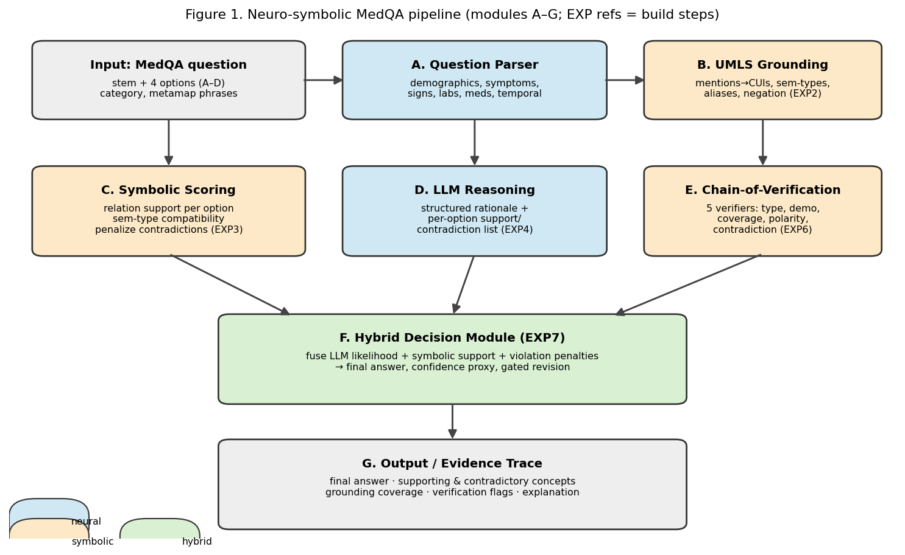
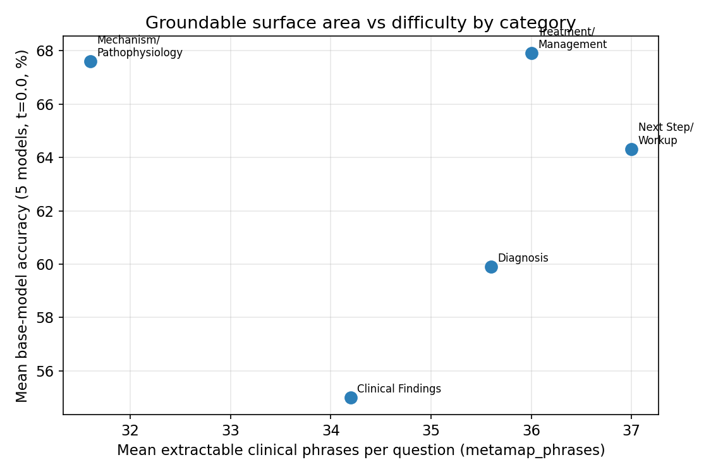

## Title (working; alternates below)
**Grounded but Brittle: UMLS-Based Verification and the Concept Mismatch Problem in
Neuro-Symbolic Medical Question Answering**

Alternates:
1. *The Concept Mismatch Problem: When Symbolic Biomedical Knowledge Fails to Ground LLM Medical Reasoning.* (concept-mismatch focus)
2. *Hybrid Neuro-Symbolic Reasoning for MedQA: Combining UMLS Grounding with Language-Model Flexibility.* (neuro-symbolic focus)
3. *Grounding LLM Medical Reasoning in UMLS: How Far Does Symbolic Knowledge Get Us?* (UMLS-grounding focus)
4. *Auditing Medical Answers: UMLS-Grounded Chain-of-Verification for Detecting Wrong LLM Reasoning.* (verification focus)
5. *Structured Knowledge Meets Language Models: A Controlled Study of UMLS Grounding and Verification for Medical Question Answering.* (biomedical-informatics venue)

---

## Abstract

Large language models answer USMLE-style medical questions well, but their reasoning is hard
to audit: they produce fluent rationales with no guarantee that the underlying clinical
concepts and relations are correct. Structured biomedical knowledge — notably the Unified
Medical Language System (UMLS) — offers grounding, traceability, and contradiction detection,
yet exact symbolic matching is brittle when clinically equivalent ideas are phrased
differently, the *concept mismatch problem*. We present a controlled study, on a
category-balanced set of 1,030 MedQA-style questions (206 each across Clinical Findings,
Diagnosis, Mechanism/Pathophysiology, Next Step/Workup, Treatment/Management), of how UMLS
grounding and symbolic verification help, fail, and combine with LLM reasoning. We compare
LLM-only, symbolic-only (concept-overlap and relation-aware), UMLS-in-prompt, verifier
reranking, UMLS-grounded Chain-of-Verification (with and without revision), and a hybrid
decision module that fuses LLM likelihood with symbolic support and violation penalties. We
quantify grounding coverage, contradiction and semantic-type violations, a concept-mismatch
taxonomy, and whether symbolic scores predict LLM errors. We expect, and motivate from
existing data, that pure symbolic scoring is far below LLM-only accuracy
[TBD-EXP3], that concept mismatch is a dominant symbolic failure mode (canonical concepts
appear under six or more surface forms in this benchmark), that verification improves weak
proposers while naive answer revision can harm [TBD-EXP6], and that grounding and violation
scores predict LLM correctness above chance [TBD-EXP9]. The contribution is an empirical
characterization of when and why symbolic biomedical knowledge helps versus fails, and a
hybrid framework that uses UMLS to *audit and constrain* rather than replace LLM reasoning.
We release data, configurations, and analysis code. We make no claims of clinical utility.

---

## 1. Introduction

**P1 — Accuracy alone is insufficient.** On MedQA, strong base LLMs already score well above
chance (Paper 1: up to 73.4% at greedy decoding on this balanced set), but a correct letter
says nothing about whether the model reasoned over the right clinical concepts. For medical
reasoning, *how* an answer is reached — and whether it can be audited — matters as much as
the answer.

**P2 — Why grounding and verification matter.** Auditable medical reasoning requires linking
claims to defined clinical concepts and checking them for support, contradiction, and
plausibility. This is precisely what free-form LLM rationales do not guarantee.

**P3 — Why UMLS is attractive.** UMLS provides millions of concepts (CUIs), semantic types,
definitions, and curated relations (e.g., `may_treat`, `manifestation_of`,
`contraindicated_with`). In principle it offers exactly the grounding, traceability, and
contradiction-detection that LLMs lack.

**P4 — Why pure symbolic UMLS reasoning is brittle.** In practice, exact concept matching is
fragile. Our seed analysis shows that the amount of groundable surface in a question is
*uncorrelated* with difficulty (per-question r=−0.02), so naive concept overlap cannot
explain — let alone fix — where models fail. Preliminary repository experiments put pure
symbolic accuracy far below LLM-only [TBD-EXP3].

**P5 — The concept mismatch problem.** A symbolic system may fail to connect "chest
discomfort" with "chest pain," or "shortness of breath" with "dyspnea." We quantify this:
in this benchmark, dyspnea appears under six distinct surface forms across 113 questions, of
which the canonical term "dyspnea" covers only 28 — so exact matching to one surface would
miss roughly three-quarters of clinically equivalent mentions.

**P6 — Proposed hybrid framework.** We propose a pipeline (Figure 1) in which UMLS grounds
and verifies while an LLM bridges semantic gaps: question parsing, UMLS grounding, symbolic
candidate scoring, LLM rationale generation, UMLS-grounded Chain-of-Verification, and a
hybrid decision module emitting an answer, a confidence proxy, and an evidence trace.

**P7 — Summary of experiments.** We compare LLM-only, symbolic-only, UMLS-in-prompt,
verifier reranking, CoVe (verify-only and with revision), and the hybrid module across the
five reasoning categories, with grounding/verification metrics, a concept-mismatch taxonomy,
ablations, and a test of whether symbolic scores predict LLM errors.

**P8 — Contributions** (Section 1.1).

### 1.1 Contributions
1. A **controlled comparison** of LLM-only, symbolic-only, and hybrid neuro-symbolic systems
   on a category-balanced MedQA set, with proper statistics.
2. An **empirical characterization of the concept mismatch problem**, including a labeled
   taxonomy and quantified surface-form prevalence in the benchmark.
3. A **UMLS-grounded verification analysis** establishing where symbolic verification helps a
   reasoning proposer and where answer revision harms it.
4. Evidence on whether **grounding coverage and symbolic violation scores predict LLM
   errors**, connecting symbolic signal to uncertainty estimation.
5. A released, reproducible **hybrid framework** that uses UMLS to audit and constrain — not
   replace — LLM medical reasoning. We make no clinical-deployment claims.

---

## 2. Related Work

*Clusters, what to cite, positioning, and the gap.*

**Medical QA benchmarks** (MedQA/USMLE — Jin et al. 2021; MedMCQA; PubMedQA). *Gap:* scored
in aggregate, no grounding/verification analysis. **LLMs for clinical reasoning** (Med-PaLM,
GPT-4 medical evaluations). *Position:* we audit reasoning rather than chase accuracy.
**Biomedical knowledge graphs** and **UMLS/SNOMED CT/MeSH concept normalization** (Bodenreider
2004; MetaMap; entity-linking literature). *Position:* we use UMLS as a grounding/verification
substrate and characterize its brittleness. **Neuro-symbolic AI** (knowledge-constrained
neural reasoning). *Position:* a concrete medical instantiation. **Retrieval-augmented /
knowledge-grounded medical QA**. *Position:* we contrast prompt-injection with
constraint/verification. **Chain-of-Verification & self-verification** (Dhuliawala et al.).
*Position:* we ground verification in a knowledge graph, not only self-checking.
**Explanation faithfulness & hallucination detection**, and **clinical decision support /
symbolic reasoning**. *Gap this paper fills:* a controlled, category-resolved account of when
UMLS grounding and symbolic verification help versus fail for LLM medical QA, centered on the
concept mismatch problem.

---

## 3. Background: UMLS and Neuro-Symbolic Medical Reasoning

*Paper-ready exposition.* **UMLS** integrates biomedical vocabularies into concepts, each with
a **CUI**, one or more **semantic types** (e.g., Disease or Syndrome, Sign or Symptom,
Pharmacologic Substance), and curated **relations** between concepts. To **ground** medical
text, mentions are linked to CUIs (entity linking), enabling traceable reasoning: an answer
can be tied to specific concepts and the relations among them, and checked for
contradictions or semantic-type incompatibility. Grounding supports **interpretability** but
is **not** clinical reasoning: a correct CUI map does not entail a correct inference.
**Concept normalization is hard** because the same clinical idea is expressed in many surface
forms, abbreviations, and granularities; **exact symbolic matching fails** when wording
diverges from canonical terms (our seed data: ≥6 surface forms per common concept). **LLMs**
can bridge these gaps via paraphrase-robust representations, but **unconstrained LLMs** still
hallucinate and cannot be audited — motivating grounding and verification as a check on, not a
replacement for, neural reasoning.

---

## 4. Dataset

The benchmark is the focused balanced MedQA subset: **1,030** questions, **206 per category**
across the five reasoning categories, 4-option (A–D), random baseline 25% (shared with
Paper 1; see Paper 1 §3 for construction and the category-label validation plan,
[TBD: EXP7 there]). Each item carries pre-extracted clinical phrases (`metamap_phrases`, mean
34.9/question), which we use both as grounding candidates and to quantify surface-form
prevalence. **Table 1** reports the category distribution. We additionally define a
**hard-core evaluation set** — the 144 questions (14.0%) that all five base models miss at
greedy decoding (Clinical Findings 41, Diagnosis 30, Next Step 30, Mechanism 22, Treatment
21) — as the focus for measuring verifier/hybrid gains.

---

## 5. Methods

*The pipeline of Figure 1; modules A–G. Build steps are EXP1–EXP10.*

**A. Question parser.** Extract stem, the four options, the reasoning category, and clinical
elements (demographics, symptoms, signs, labs, medications, history, temporal cues).

**B. UMLS concept grounding (EXP1–EXP2).** Map clinical mentions in the stem and each option
to CUIs with semantic types, aliases, and confidence; handle negation/uncertainty
(present/absent/uncertain). Emit grounding coverage and per-option grounding rate.

**C. Symbolic candidate scoring (EXP3).** Score each option by relation support
(category-appropriate UMLS relations), semantic-type compatibility, and penalties for
unsupported or contradictory relations; concept-overlap and relation-aware variants.

**D. LLM reasoning generation (EXP4).** Produce a structured rationale with an evidence table
and, per option, an explicit support/contradiction list.

**E. Chain-of-Verification (EXP6).** Verify rationale claims against UMLS with five symbolic
verifiers — semantic-type incompatibility, demographic implausibility, low grounding
coverage, polarity/negation conflict, internal contradiction — optionally triggering revision.

**F. Hybrid decision module (EXP7).** Fuse LLM answer likelihood with symbolic support and
violation penalties; apply gated revision; output a final answer and confidence proxy.

**G. Output / evidence trace.** Final answer with supporting and contradictory concepts,
grounding coverage, verification flags, and a human-readable explanation trace.

{width=95%}

*Figure 1. Neuro-symbolic MedQA pipeline (modules A–G). Build steps map to EXP1–EXP10.*

---

## 6. Experimental Setup

**Systems compared (Table 2).** (i) random/majority baseline (25%); (ii) **LLM-only**
(verified, Paper 1); (iii) pure symbolic — concept-overlap, relation-aware (EXP3); (iv) TF-IDF
lexical baseline (EXP3); (v) UMLS-in-prompt (EXP4); (vi) UMLS verifier reranking (EXP5);
(vii) CoVe verify-only and (viii) CoVe with revision (EXP6); (ix) hybrid decision (EXP7); and
an oracle upper bound (best-of-systems) for context. **LLM components** use vLLM with the
configs in `configs/`; **symbolic components** use the UMLS index from EXP1. **Statistics:**
bootstrap CIs, McNemar for paired differences, paired bootstrap for category comparisons,
logistic regression for correctness prediction, AUROC/AUPRC for error prediction, and
category×method interaction tests — reusing the verified Paper 1 statistics harness. We will
**avoid overclaiming**: small or mixed improvements will be reported with CIs and not framed
as decisive.

---

## 7. Results

*All neuro-symbolic numbers are placeholders pending experiments; the LLM-only column is
verified (Paper 1).*

**7.1 Overall accuracy by method (Table 3).** LLM-only baseline (t=0.0): OLMo-3 7B 46.18 …
Qwen2.5 32B 73.40. Symbolic-only: [TBD-EXP3] (expected well below LLM-only; README anecdote
~30% pure UMLS, ~0% TF-IDF). UMLS-in-prompt [TBD-EXP4]; verifier rerank [TBD-EXP5]; CoVe
verify-only / with-revision [TBD-EXP6]; **hybrid** [TBD-EXP7].

**7.2 Category-specific accuracy (Table 4, Figure 4).** [TBD] per-method × category; test
whether symbolic grounding helps Diagnosis/Mechanism more than Treatment/Workup (BRIEF H7).
Seed context: base difficulty ordering has Clinical Findings hardest, Mechanism/Treatment
easiest, and difficulty is *uncorrelated* with groundable phrase count (r=−0.02).

{width=95%}

*Seed figure. Groundable surface area (mean extractable clinical phrases) vs base-model accuracy by category. Difficulty is not explained by how much there is to ground.*

**7.3 Grounding and verification metrics (Table 5).** Grounding coverage and answer-choice
grounding rate [TBD-EXP2]; verifier firing rates and violation distributions [TBD-EXP6];
verification precision/recall against manual labels [TBD-EXP6/EXP8].

**7.4 Verification helps, revision can harm.** [TBD-EXP6] — reproduce/qualify the README
pattern (verify-only > baseline; revision ≤ verify-only) on the full balanced set with CIs.

**7.5 Symbolic scores predict LLM errors (Figures 5, 6).** [TBD-EXP9] AUROC for predicting
LLM correctness from grounding coverage and violation scores; risk–coverage curve.

---

## 8. Concept Mismatch Analysis

*A central section. Taxonomy in Table 6; examples in Figure 7; labels from EXP8.*

We organize symbolic failures into a taxonomy: lexical-synonym, clinical-paraphrase,
granularity, symptom↔diagnosis, mechanism↔disease, treatment-indication, lab-value
normalization, negation/uncertainty, temporal, relation-sparsity, missing-UMLS-relation,
overly-broad semantic type, overly-narrow mapping, and answer-choice abstraction mismatch.
For each: definition, a MedQA example, effect on symbolic scoring, how an LLM may bridge it,
and how the LLM may still fail.

**Empirical anchor (verified seed).** Canonical concepts appear under many surface forms in
this benchmark — dyspnea: 6 forms across 113 questions (shortness of breath 57, dyspnea 28,
difficulty breathing 21, …); chest pain: 6 forms across 55 questions; myocardial infarction:
5 forms (incl. STEMI 10, "heart attack"). Exact matching to a single canonical surface would
systematically miss equivalent mentions, the mechanistic root of symbolic brittleness.
[TBD-EXP8: distribution of mismatch types over symbolic failures and the hard-core set, with κ.]

---

## 9. Discussion

The thesis is that **UMLS grounding alone is insufficient and LLM reasoning alone is not
trustworthy enough**; the research value lies in how a hybrid system uses structured
knowledge to **audit, constrain, and explain** while relying on the LLM to bridge semantic
gaps. We expect symbolic-only methods to underperform, UMLS-in-prompt to give limited gains
(context ≠ constraint), verification to help weak proposers, and naive revision to risk harm —
so the productive role of symbolic knowledge is as a **verifier and error detector** (§7.5)
and an **explanation substrate**, not a standalone solver. An **error taxonomy** for the
hybrid system (LLM-right/symbolic-wrong and vice versa, verifier true/false positives,
grounding/relation failures, revision harm) will indicate which failures future agentic
systems must address. We will state clearly where gains are small, mixed, or category-specific.

---

## 10. Limitations

MedQA is exam-style, not clinical practice; multiple choice may overstate reasoning. UMLS is
incomplete and not a reasoning engine; concept-extraction and entity-linking errors propagate
downstream; symbolic relations encode causal/temporal reasoning poorly. LLM rationales may be
unfaithful, so explanation metrics need manual validation. Hybrid gains may be
category-dependent, and answer revision can introduce harm. The neuro-symbolic results here
are **pending experiments** (the system is not yet run in this snapshot), and the preliminary
numbers quoted from the repository README are unverified. The system provides no medical
advice or clinical decision support.

---

## 11. Future Work

This paper sets up **Paper 3's agentic neuro-symbolic diagnosis**: from static answer
selection toward **adaptive evidence acquisition** that chooses which clinical evidence to
seek next; **category-specific reasoning modules**; **probabilistic belief updates** over a
differential; **contradiction-aware planning** using the verifiers developed here;
**differential diagnosis** rather than single-answer selection; **medical knowledge-graph
expansion** to reduce concept mismatch; and **executable, interpretable evidence traces**.
The verification and grounding components built for Paper 2 become the trustworthiness layer
of that agent.

---

## 12. Conclusion

We frame and study the concept mismatch problem and the broader question of how structured
biomedical knowledge can ground and verify LLM medical reasoning. Using a category-balanced
MedQA benchmark, we compare LLM-only, symbolic-only, and hybrid systems and characterize where
symbolic grounding and verification help versus fail. The expected and seed-supported finding
is that symbolic knowledge is most valuable not as a solver but as an **auditor** of LLM
reasoning — detecting contradictions, weak grounding, and likely errors — while the LLM
supplies the semantic flexibility symbolic matching lacks. Data, configurations, and analysis
code are released; we make no clinical-utility claims.

---

## Appendix / Reproducibility (outline)
- A. UMLS index manifest (release, concept/relation counts) — EXP1.
- B. Grounding and prompt templates — EXP2/EXP4.
- C. Verifier definitions and thresholds — EXP6.
- D. Full per-method, per-category tables — EXP3–EXP7, EXP10.
- E. Concept-mismatch annotation guide and κ — EXP8.
- F. Error-prediction features and model — EXP9.

## Figures and tables (asset map)
- Table 1 dataset distribution · Table 2 system variants · Table 3 overall accuracy by method
  · Table 4 category accuracy by method · Table 5 grounding/verification metrics · Table 6
  concept-mismatch taxonomy · Table 7 ablations.
- Figure 1 pipeline (`figures/fig1_pipeline.png`, ready) · Figure 2 grounding example
  [TBD-EXP2] · Figure 3 accuracy LLM-only/symbolic/hybrid [TBD-EXP3/7] · Figure 4
  category-gain heatmap [TBD-EXP7] · Figure 5 grounding coverage vs correctness [TBD-EXP9] ·
  Figure 6 violation score vs error probability [TBD-EXP9] · Figure 7 concept-mismatch
  examples [TBD-EXP8]. Seed figure: groundable surface vs difficulty
  (`figures/fig_seed_phrase_vs_acc.png`).

## Publication strategy (notes)
arXiv-first. Strong fits: biomedical-informatics venues (AMIA), ML-for-health (ML4H, CHIL),
clinical-NLP, and neuro-symbolic / knowledge-representation workshops. Minimum to submit:
EXP1–EXP3 + EXP6 + EXP9 (symbolic-insufficient, verification-helps, scores-predict-error).
EXP4/5/7 complete the hybrid comparison; EXP8/10 add the concept-mismatch depth and mechanism
attribution reviewers will want.
